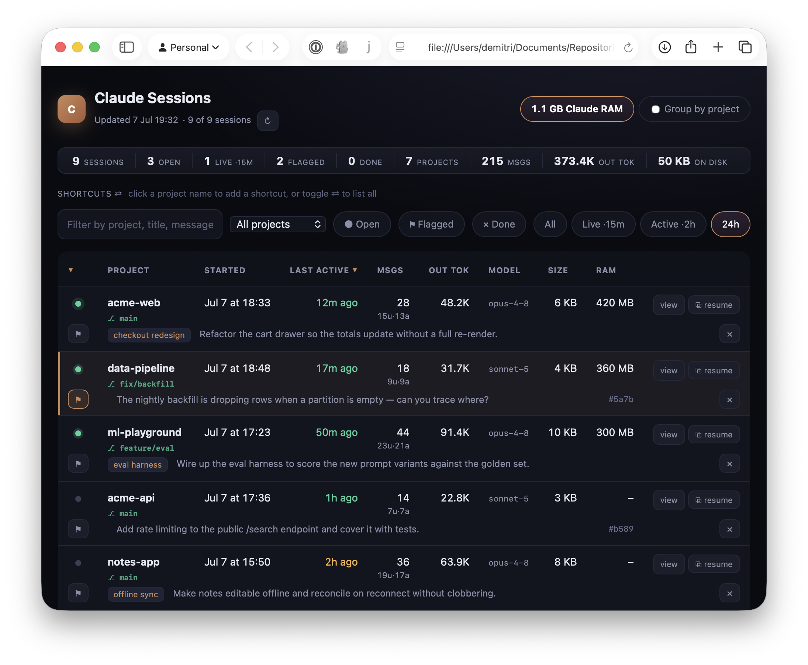

# Claude Sessions

**A local dashboard for your Claude Code sessions.**

Do you tend to have a large number of Claude sessions in flight? Do you find yourself wishing you could reopen a session that you closed two weeks ago? Are sessions taking up too much RAM but you don’t want to start closing them because of unfinished work?

Claude Sessions is the answer – it’s a single-file Python server with no dependencies that gives you a detailed dashboard of all your sessions. Total memory used, number of sessions, and token usage are all displayed. Sessions are searchable by name, project, or last active. Even after you close a session the full transcript remains on your computer (subject to the `cleanupPeriodDays` [setting](https://code.claude.com/docs/en/settings), default 20 days), ready to be reopened at any time. You can even review the full transcript of past sessions without opening Claude and spending tokens. And I mean *full* transcript – read the subagent calls, responses, tool use, etc.

For those “I can’t close this session because I’m still using it!” windows, just find the session in the dashboard, click the “flag” icon, and close the session. You can then view all flagged sessions in the dashboard and copy the command to reopen them where they left off – freeing up precious RAM in the meantime. This project was born from a memory- and disk-full incident with 10+ open sessions that needed to survive a reboot – the on-disk history made the working set recoverable, and this dashboard turns that state into a live console for finding, triaging, and resuming your work.

## Starting the Dashboard

Nothing to install, no dependencies, no daemon, just a recent Python 3.x. The dashboard is a single-file Python server that runs on the standard library.

```bash
git clone https://github.com/demitri/claude-sessions.git
cd claude-sessions
python3 claude-status.py
```

This serves the dashboard on <http://127.0.0.1:7878> and opens your browser.

```bash
python3 claude-status.py --port 9000   # serve on a different port
python3 claude-status.py --no-open     # don't auto-open the browser
python3 claude-status.py --once        # write a static index.html snapshot and exit
python3 claude-status.py --done        # mark the current session "done" and exit
```

The server rescans `~/.claude/projects/` on every request (cached per file by mtime + size), and the page auto-refreshes every 30 seconds.

<p align="center">
  
</p>

## Features

- **Everything at a glance** – every session grouped by project directory, with start time, last-active (colour-coded by recency), message counts, model, git branch, output tokens, and on-disk size.
- **Live status** – a coloured dot per session: green for open, pulsing for busy, grey for closed – detected from the running Claude processes, not guessed from file mtimes.
- **One-click resume** – the ⧉ button copies `cd "<dir>" && claude --resume <id>` straight to your clipboard.
- **Transcript reader** – a **view** link opens the full conversation on its own linkable page: distinct user/assistant turns, collapsed tool-calls and thinking, in-transcript search, a prompt-jump sidebar, and lazy subagent expansion.
- **Reboot survival** – ⚑ flag the sessions you’re not done with, restart, filter to “Flagged”, and resume them. Marks persist server-side across reboots and browsers.
- **Filter & sort** – free-text search (project / title / message / branch / id / model), a project dropdown, recency chips, and sortable columns.
- **Memory footprint** – a per-session RAM column and a header chip totalling how much memory your open sessions are holding – a number the OS can’t tell you.
- **Mark sessions done** – `/done` in a session (or the ✕ button in the dashboard) drops a finished session from the default view. It’s not deleted – a toggle brings done sessions back.

## The `/done` Slash Command

An example `/done` command ships in `commands/done.md`. Copy it to `~/.claude/commands/done.md` and set the checkout path (see the note at the top of the file). It marks the **current** session done – reading `$CLAUDE_CODE_SESSION_ID`, so it takes no argument – dropping it from the dashboard’s default view. Type `/done` then `/exit` to close out a finished session in one gesture.

The raw CLI also accepts an optional session id or the statusline’s last-4 (`python3 claude-status.py --done 6789`) for marking a session done from a plain terminal, outside any session. A running dashboard picks the mark up on its next refresh.

## How It Works

Everything lives in `claude-status.py` – a stdlib `ThreadingHTTPServer` backend and a single embedded HTML/CSS/JS page, no build step and no framework. The backend scans `~/.claude/projects/*/*.jsonl`, parses each session defensively (the format is an undocumented Claude Code internal, so malformed *lines* are skipped, never whole files), and serves the data as JSON. Live status comes from `~/.claude/sessions/<pid>.json`, cross-checked against the running processes.

For a deeper tour, see [`AI/dashboard.md`](AI/dashboard.md); for orientation, [`AI/START_HERE.md`](AI/START_HERE.md).

## Privacy

Everything runs locally and binds to `127.0.0.1`. Nothing is sent anywhere – the dashboard only reads the session files Claude Code already wrote to your disk.

## License

[MIT](LICENSE) © Demitri Muna
